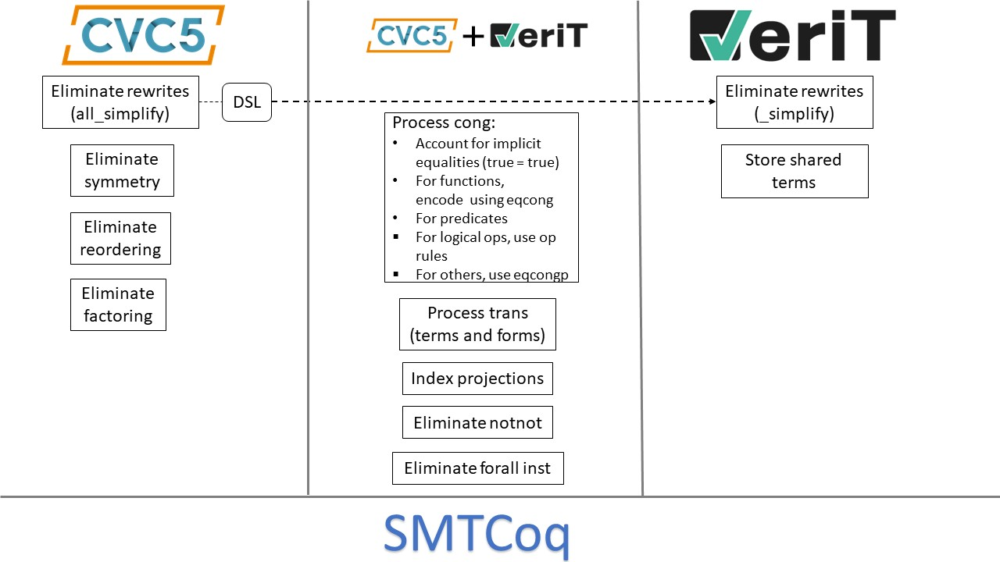

# Status Quo
In its current mode of operation, SMTCoq has a proof certificate format which is really close to the
veriT-2016 proof format. VeriT's proofs are converted to this format without any difficulty and so are
cvc4's LFSC proofs with some difficulty.

# Goal
We want to adapt SMTCoq so that it accepts [alethe](https://verit.loria.fr/documentation/alethe-spec.pdf) proofs 
instead. That way, it will be upto date with veriT's current proof format, and once the efforts to produce 
alethe proofs are completed, it will be easier to handle cvc5 proofs.

SMTCoq parsed verit-2016 proofs directly to internal SMT terms. We introduce an AST layer and parse 
alethe proofs to create ASTs. We deal with most differences between Alethe and verit-2016 at the 
AST layer.
Old Pipeline:
```
                 Parser
verit-2016 proof ------> SMT terms
```
New Pipeline:
```
              Parser       Transformations
Alethe proof  ------>  AST ---------------> Modified AST (closer to verit-2016 proof) ----> SMT terms
```
Our immediate goal is to achieve this for EUF + LIA + a small part of quantifier rules.
In the long term, we want to restore support for AX and BV that we have with LFSC, but
for this, rules in alethe for these theories must be defined first, and cvc5 should
produce them.

## Transformations
We perform the following transformations on the parsed AST:
1. Storing shared terms
2. Processing `forall_inst` rule
3. Processing `notnot` rule
4. Processing `_simplify` rules
5. Processing `_subproof` rules
6. Processing projection rules
7. Processing `_cong` and `trans` rules
8. Processing `all_simplify` rules (cvc5 rewrites)
9. Processing `evaluate` rules (cvc5 constant folding)
10. Processing `symm`, `reordering`, and `factoring` (from cvc5)

|  |
|-|

### Storing Shared Terms
We want to support term-sharing on the proofs where terms have names. We go through
the proof and hash name-term pairs, while replacing all terms by their names. The 
names are replaced with terms in the final processing stage.

### Processing Forall Instantiation
Quantified hypotheses are shallowly embedded as Props, but have no deep embedding. 
Proofs containing universally quantified formualas are used by SMTCoq only when the 
formulas are fully instantiated in the proof. Thus, SMTCoq only supports the 
`forall_inst` rule which has the form `QH -> Inst`, where `QH` is the quantified 
hypothesis of type Prop, and `Inst` is the instantiated quantifier-free formula 
of type `Bool`. SMTCoq translates the proof step `QH -> Inst` into `Inst`. 
To convert `QH -> Inst`, we need a proof of `QH`, and a proof of `QH -> Inst` 
(and then we apply modus ponens). We have a proof of `QH` since it is a hypothesis, 
and `QH -> Inst` is proved using a variant of the `auto` tactic. This rule does
require that we search the proof to find `QH` from the hypotheses.
So the proof of a `forall_inst` rule looks like this:
```
    variant of `auto`	    Term from `intro`
------------------------	-----------------
(forall x, p x) -> (p a)	 (forall x, p x)
-----------------------------------------------
                   (p a)
```

The infrastructure to do all this already exists in SMTCoq. Additionally,
alethe proofs do a lot of alpha renaming of quantified variables in subproofs
and also introduce `qnt_cnf` rules that are unsupported. In this transformation, 
we ignore the alpha renaming subproofs, and deal with any instances of `qnt_cnf`.

### Processing Double Negations
The `notnot` rule for some `x` proves the clause `~~x, x`. SMTCoq implicitly
eliminates double negation, so this would be proving `x,x`. In this 
transformation, we remove all instances of `notnot` rules and any 
occurence of these instances as premises to other rules.
So typically, a proof that eliminates `~~` by doing the following
```
   ...
 -------   ---------not_not
 ~~x v C    ~~~x v x
--------------------reso
       x v C
```
can be replaced by the following, since double negations 
are implicitly simplified at the term level, and since
SMTCoq supports resolutions with single arguments.
```
  ...
 -------
  x v C
--------reso
  x v C
```

### Processing Solver Rewrites
Alethe has a large set of rules that represent solver rewrites, that aren't
present in the verit-2016 rules. These have a `_simplify` suffix in the rule 
name. For all the EUF `_simplify` rules, this transformation replaces the
rule instance by a derivation using the verit-2016 rules. Rewrites are 
essentially hard-coded. 2 things to consider:
1. The alethe spec consists of veriT rewrites only, cvc5 rewrites will
be different. For this, we hope to use the cvc5's DSL infrastructure. 
We hope that the DSL can rewrite the cvc5 rewrites in terms of the veriT
rewrites, so our transformation still works.
2. On all theh LIA rules, SMTCoq calls the Micromega tactic. I'm not 
sure how successful this is, but the LIA rewrites also call Micromega 
now.

### Processing Subproofs (Flattening)
Alethe has 2 types of subproofs:
1. Subproofs that push into a context at the beginning and pop from the context at the end. 
2. Subproofs that introduce an assumption `h` and discharge the assumption using `g`, proving `h => g`.
We handle type 1 subproofs only on a case-by-case basis. For instance, we eliminate
subproofs that only do alpha-renaming while dealing with `forall_inst`. We handle
all type 2 subproofs by flattening.
Proof with type 2 subproof:
```
...

Pi_1
----
C
-------
|  H  |
| ... |
|  G  |
|-----|
~H v G
...
Res (~H v G) H
--------------
     G
...
Res G ~G
--------
   []
```
Flattened proof:
```
...
C
-----------------not_and (ImmBuildDef)
(H ^ ~G) v ~H v G
...
Res ((H ^ ~G) v ~H v G) H
-------------------------
(H ^ ~G) v G
...
Res ((H ^ ~G) v G) ~G
---------------------
H ^ ~G
----and (H ^ ~G) (ImmBuildProj 1)
~G
--and (H ^ ~G) (ImmBuildProj 2)
H
-------
| ... |
|  G  |
-------
Res G ~ G
---------
   []
```

### Processing Projection Rule Instances
Rules that project a term from a formula (ex: projection of
conjunct from a conjunction) took an argument specifying 
the index of the term to project in verit-2016. So the backend
expects this argument, whereas these rules don't have this 
argument anymore in alethe. This transformation searches the
term for the index and specifies as the argument for the
backend.

### Processing `cong` and `trans` Rule Instances
Verit-2016 has rules `eq_congruent` and `eq_congruent_pred` that state 
congruence of functions and predicates as tautologies. Additionally, 
alethe has the `cong` rule which performs congruence (of both cases) in a
premise-conclusion format. This transformation replaces `cong` instances
by derivations that use either of the verit-2016 rules. 

The `cong` rule is more expressive than the previous congruence
rules in that it supports congruence over logical operators. To encode
these, we use introduction and elimination rules of the logical operations 
in question. For example, the following instance of `cong`:
```
 -----  -----
 x = a  y = b
--------------cong
 x ^ y = a ^ b 
```
can be converted into:
```
(1)       (2)
-------------res
x ^ y = a ^ b
```
where `(1)` and `(2)` are derived as:
```
                    -----   ---------------eqp2  -----   -----------------eqp2                                                                          
                    x = a   ~(x = a), ~a, x      y = b   ~(y = b), ~b, y                                                                                
---------------andn ----------------------res   -------------------------res  ------------andp    ------------andp                                      
(x ^ y), ~x, ~y             ~a, x                         ~b, y                ~(a ^ b), b         ~(a ^ b), a                                          
--------------------------------------------------------------------------------------------------------------res  ---------------------------------eqn2
                                            ~(a ^ b), (x ^ y)                                                       x ^ y = a ^ b, (x ^ y), (a ^ b)     
                      -----------------------------------------------------------------------------------------------------------------------------res  
                                                                  x ^ y = a ^ b, (x ^ y) --(1)

                     -----   ---------------eqp1 -----   -----------------eqp1
                     x = a   ~(x = a), ~x, a     y = b    ~(y = b), ~y, b
---------------andn  -----------------------res  ------------------------res  -----------andp -----------andp
(a ^ b), ~a, ~b               ~x, a                       ~y, b               ~(x ^ y), x     ~(x ^ y), y
---------------------------------------------------------------------------------------------------------res  ---------------------------------eqn1
                                                 ~(x ^ y), (a ^ b)                                            x ^ y = a ^ b, ~(x ^ y), ~(a ^ b)
                                                 ---------------------------------------------------------------------------------------------res
                                                                                           x ^ y = a ^ b, ~(x ^ y) --(2)
```
Similarly, `trans` is more expressive in that it supports transitivity over terms and formulas. For terms, it
can be encoded in terms of `eq_transitive`:
```
Convert a proof of the form:
...
a = b    b = c    c = d
-----------------------trans
         a = d
         
to:
...
-----------------------------------eqtrans
~(a = b), ~(b = c), ~(c = d), a = d         a = b    b = c    c = d
-------------------------------------------------------------------res
                                a = d
```
For formulas, it can be encoded using rules for equivalences:
```
Convert a proof of the form:
-----  -----
a = b  b = c
------------trans
    a = c

to one of the form:
(1)   (2)
---------res
  a = c
where (1) and (2) are derived as:
---------------eqp1  -----     ---------------eqp1  -----
~(a = b), a, ~b      a = b     ~(b = c), b, ~c      b = c
--------------------------res  --------------------------res 
           a, ~b                          b, ~c
           ------------------------------------res    -----------eqn2
                           a, ~c                      a = c, a, c
                           --------------------------------------res
                                          a = c, a   ---(1)

---------------eqp2  -----      ---------------eqp2  -----
~(b = c), ~b, c      b = c      ~(a = b), ~a, b      a = b
--------------------------res  --------------------------res
           ~b, c                          ~a, b
           ------------------------------------res    -------------eqn1
                           ~a, c                      a = c, ~a, ~c
                           ----------------------------------------res
                                          a = c, ~a   ---(2)   
```
This task can be further divided into:
- [x] Support `cong`:
 - [x] `cong` over terms using `eq_congruent`
 - [x] `cong` over predicates:
  - [x] `cong` over user-defined predicates using `eq_congruent_pred`
  - [x] `cong` over `and`
  - [x] `cong` over `or`
  - [x] `cong` over `not`
  - [x] `cong` over `imp`
  - [x] `cong` over `iff`
  - [x] `cong` over `xor`
  - [x] `cong` over `ite`
- [x] Support `trans`:
 - [x] `trans` over terms using `eq_transitive`
 - [x] `trans` over formulas using rules for `iff`
A few complications:
- [x] Implicit arguments `(true = true)` were accounted for over other cases of `cong`, the same must be done for logical operators as well (with proper code reuse).
- [x] The implicit `true = true` arguments are handled using `refl` but `refl` uses `trans` so a formula version of them must be used.
- [x] SMTCoq's resolution checker fails when the pivor appears with both polarities in one of the clauses. So for example, some implcit argument `x = x`
is generated and resolved with `~(x = x), x, ~x (eqp1)` to get `x, ~x` which is further resolved with other things, but it would always fail because
`x` would be the pivot and it would occur in both polarities. 

### Processing `all_simplify` Rule Instances (cvc5 Rewrites)
Ideally we can just use the DSL to rewrite these rule applications w.r.t. rules supported above.
1. Clone cvc5/proof-new
2. Replace the RARE file in each theory (theory/th-name/rewrites) with the target rewrite rules (`_simplify` rules from alethe)
(`ite` rules go in builtin)
- Compile
- Run cvc5 with the following options
```
cvc5 filename.smt2 --dump-proofs --proof-format-mode=alethe --proof-granularity=dsl-rewrite --dag-thresh=0
```
- Check if the produced proofs have any `all_simplify` applications with no arguments (args). If it does,reconstruction has failed.

### Processing `evaluate` Rule Instances from cvc5 (Constant Folding)
Conjecture: all constant folding instances for Booleans can be represented by veriT's `_simplify`
rules.

Conjecture: LIA constant folding can be handled by the Micromega decision procedure used by SMTCoq. 
- [x] Change cvc5's alethe printer to print `op_simplify` where `op` is the head of the term 
being rewritten.

### Processing `symm`, `reordering`, `factoring` from cvc5
These should all be soundly removed from the proof. For example,
```
(step x ...)
...
(step y ... :rule symm :premises (x))
...
(step z ... :premises (y, ...))
```
changes to
```
(step x ...)
...
(step z ... :premises (x, ...))
```

## Rules
This section at coverage in terms of rules in alethe and verit-2016. 
### No Modifications
These are the rules that require no work since both alethe and verit-2016 
have the same version of them.
| Rule Name             | Theory |
|-----------------------|--------|
| false                 | EUF    |
| true                  | EUF    |
| and                   | EUF    |
| and_neg               | EUF    |
| and_pos               | EUF    |
| eq_congruent          | EUF    |
| eq_congruent_pred     | EUF    |
| eq_reflexive          | EUF    |
| eq_transitive         | EUF    |
| equiv_neg1            | EUF    |
| equiv_neg2            | EUF    |
| equiv_pos1            | EUF    |
| equiv_pos2            | EUF    |
| equiv1                | EUF    |
| equiv2                | EUF    |
| implies               | EUF    |
| implies_pos           | EUF    |
| implies_neg1          | EUF    |
| implies_neg2          | EUF    |
| ite_neg1              | EUF    |
| ite_neg2              | EUF    |
| ite_pos1              | EUF    |
| ite_pos2              | EUF    |
| ite1                  | EUF    |
| ite2                  | EUF    |
| not_and               | EUF    |
| not_equiv1            | EUF    |
| not_equiv2            | EUF    |
| not_implies1          | EUF    |
| not_implies2          | EUF    |
| not_ite1              | EUF    |
| not_ite2              | EUF    |
| not_or                | EUF    |
| not_xor1              | EUF    |
| not_xor2              | EUF    |
| or                    | EUF    |
| or_neg                | EUF    |
| or_pos                | EUF    |
| resolution            | EUF    |
| th_resolution         | EUF    |
| xor_neg1              | EUF    |
| xor_neg2              | EUF    |
| xor_pos1              | EUF    |
| xor_pos2              | EUF    |
| xor1                  | EUF    |
| xor2                  | EUF    |
| la_disequality        | LIA    |
| la_generic            | LIA    |
| la_tautology          | LIA    |
| lia_generic           | LIA    |

### Modified Rules
These are the more interesting rules that either need a transformation or
some other form of modification, or in the worst case, added support,  
to work with SMTCoq.
| Rule Name             | Theory | Modification                                      | Done |
|-----------------------|--------|---------------------------------------------------|------|
| and_simplify          | EUF    | Process `_simplify`                               | [x]  |
| bool_simplify         | EUF    | Process `_simplify`                               | [x]  |
| eq_simplify           | EUF    | Process `_simplify`                               | [x]  |
| equiv_simplify        | EUF    | Process `_simplify`                               | [x]  |
| implies_simplify      | EUF    | Process `_simplify`                               | [x]  |
| ite_simplify          | EUF    | Process `_simplify`                               | [x]  |
| not_simplify          | EUF    | Process `_simplify`                               | [x]  |
| or_simplify           | EUF    | Process `_simplify`                               | [x]  |
| not_not               | EUF    | Process `notnot`                                  | [x]  |
| comp_simplify         | LIA    | Micromega                                         | [x]  |
| div_simplify          | LIA    | Micromega                                         | [x]  |
| minus_simplify        | LIA    | Micromega                                         | [x]  |
| prod_simplify         | LIA    | Micromega                                         | [x]  |
| sum_simplify          | LIA    | Micromega                                         | [x]  |
| unary_minus_simplify  | LIA    | Micromega                                         | [x]  |
| la_rw_eq              | LIA    | Micromega                                         | [x]  |
| assume                | Misc   | Rename `input`                                    | [x]  |
| subproof              | Misc   | Process subproof                                  | [x]  |
| cong                  | EUF    | Process `cong`                                    | [x]  |
| trans                 | EUF    | Modify similar to process `cong`                  | [x]  |
| ac_simp               | EUF    | Add                                               | [ ]  |
| refl                  | EUF    | Dealt with when used with `forall_inst`           | [ ]  |
| tautology             | EUF    | Add                                               | [ ]  |
| contraction           | EUF    | Add                                               | [ ]  |
| distinct_elim         | EUF    | Modify `tmp_distinct_elim`                        | [ ]  |
| ite_intro             | EUF    | Add                                               | [ ]  |
| bfun_elim             | EUF    | Add                                               | [ ]  |
| let                   | Misc   | Not sure what's done with `Tple` (`tmp_let_elim`) | [ ]  |
| nary_elim             | Misc   | Add                                               | [ ]  |
| qnt_simplify          | Quant  | Add                                               | [ ]  |
| bind                  | Quant  | Handled with `forall_inst`                        | [ ]  |
| onepoint              | Quant  | Add                                               | [ ]  |
| qnt_cnf               | Quant  | Add                                               | [ ]  |
| qnt_join              | Quant  | Add                                               | [ ]  |
| qnt_rm_unused         | Quant  | Add                                               | [ ]  |
| sko_ex                | Quant  | Add                                               | [ ]  |
| sko_forall            | Quant  | Add                                               | [ ]  |

# Tests
This is a big addition to SMTCoq in the order of 1000s of lines of code. The only way to validate its
soundness is by testing. We want Alethe proofs with enough rule coverage so we are able to test all
the rules in the Alethe specfication and all its variants. The bad new is that in these 1000s of lines
of code added by a single person, there are bound to be a lot of bugs. The good news is that these won't
affect the soundness of SMTCoq. A proof must prove the formula it claims to prove, otherwise SMTCoq will
fail. In the worst case, if a rule isn't encoded properly, proofs that contain instances of that rule
won't work, making SMTCoq more incomplete, but it won't be able to prove things that don't stand. 